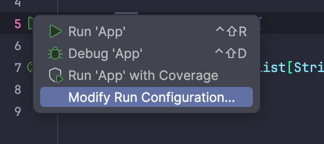
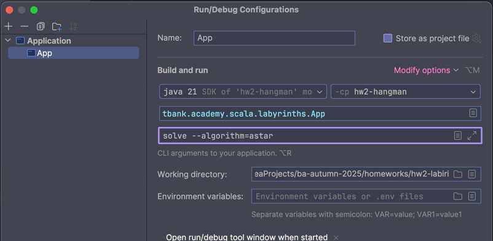
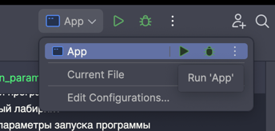

# Тесты

Здесь собраны тесты для самопроверки ваших алгоритмов.

Структура директории:

- `cases` - директория с тестами, каждый тест в отдельной директории:
  - `expected.txt` - ожидаемый ответ в консоли ил в результате выполнения функции программы
  - `maze.txt` - исходный лабиринт
  - `run_params.txt` - параметры запуска программы

## Как запускать приложение с аргументами через IntelliJIdea

1. Перейти в настройки запуска приложения (`Run` -> `Modify Run Configuration...`)
    
2. Добавить в поле `program arguments` аргументы запуска программы
    
3. Запустить приложение как обычно, используя приложение, в котором изменили параметры запуска
    
